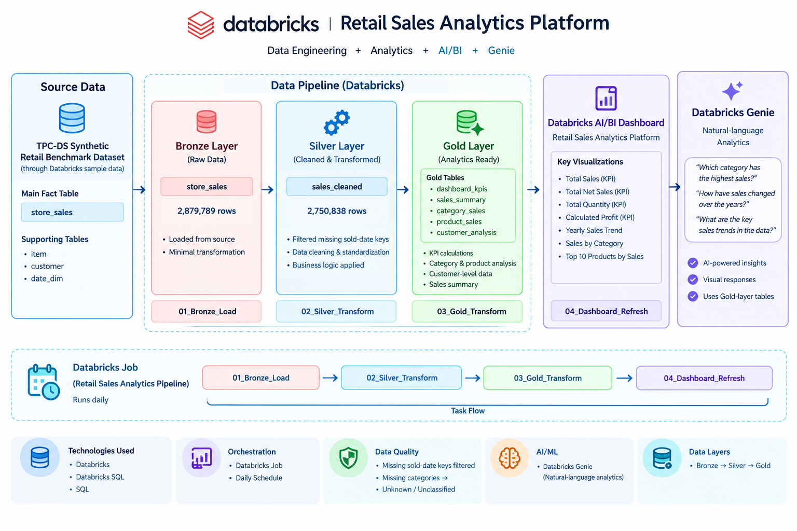
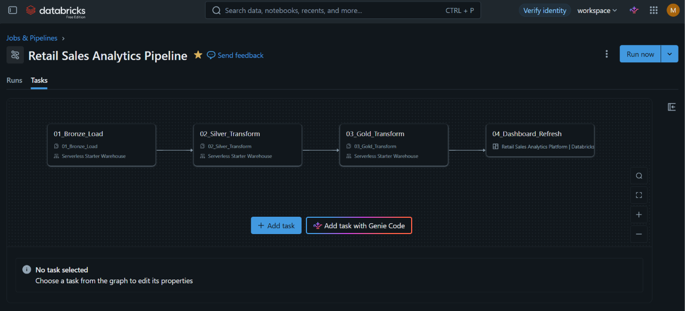
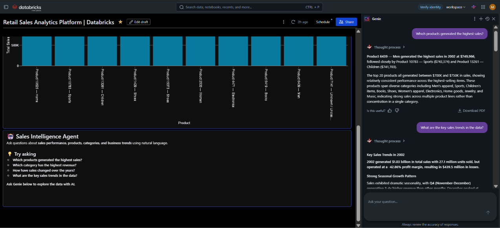

# Retail Sales Analytics Platform | Databricks

An end-to-end retail sales analytics project built using Databricks, SQL, PySpark, Databricks Jobs, AI/BI Dashboards, and Databricks Genie.

The project demonstrates how raw retail sales data can be transformed through a Bronze → Silver → Gold data pipeline and used to create business-focused analytics and interactive dashboards.

---

## 📌 Project Overview

This project analyzes retail sales data using Databricks.

The pipeline takes raw sales data through multiple transformation layers:

**Source Data → Bronze → Silver → Gold → Dashboard → Genie**

The final Gold-layer tables are used to create KPIs, sales trends, category analysis, product analysis, and customer-level insights.

---

## 🎯 Problem Statement

Retail businesses generate large volumes of sales data that can be difficult to analyze directly.

The objective of this project is to build a structured data pipeline that:

- Loads raw retail sales data
- Cleans and transforms the data
- Applies business logic
- Creates analytical Gold-layer tables
- Validates data quality
- Automates the pipeline using Databricks Jobs
- Provides interactive dashboards for business analysis
- Enables natural-language analysis using Databricks Genie

---

## 🏗️ Architecture



The architecture follows a layered data engineering approach:

**Source Data → Bronze → Silver → Gold → AI/BI Dashboard → Databricks Genie**

---

## 📊 Data Source

The project uses a synthetic **TPC-DS retail benchmark dataset** available within the Databricks environment.

The main sales fact table used in the project is:

- `store_sales`

Supporting product, customer, and date information is also used during transformations and analysis.

### Bronze Layer

The Bronze layer stores the raw sales data.

The `store_sales` Bronze table contains approximately **2.88 million records**.

---

## 🔄 Data Pipeline

The pipeline consists of three main data-processing stages.

### 1. Bronze Layer

Raw retail sales data is loaded into the Bronze layer with minimal transformation.

### 2. Silver Layer

The Silver layer cleans and transforms the raw data.

Transformations include:

- Filtering records with missing sold-date keys
- Calculating Net Sales
- Calculating Profit
- Generating readable product display names
- Handling missing product categories
- Classifying records into Full Year / Partial Year

The Silver `sales_cleaned` table contains approximately **2.75 million records** after transformation and filtering.

### 3. Gold Layer

The Gold layer contains business-ready analytical tables used by the dashboard.

Examples include:

- `dashboard_kpis`
- `sales_summary`
- `category_sales`
- `product_sales`

These tables provide aggregated information for business analysis.

---

## 💰 Business Logic

### Profit Calculation

Profit is calculated as:

**Profit = Net Sales − Extended Wholesale Cost**

### Missing Categories

Missing product categories are mapped to:

**Unknown / Unclassified**

### Year Classification

Sales data is classified into:

- Full Year
- Partial Year

This helps prevent incomplete yearly data from being incorrectly interpreted as a complete annual trend.

---

## ✅ Data Quality

Data quality checks were performed as part of the pipeline.

The Silver transformation includes filtering and validation logic to ensure that records with missing required sold-date keys are not passed into the analytical layer.

The project focuses on practical data cleaning and validation rather than advanced data-quality frameworks.

---

## ⚙️ Workflow Orchestration

The pipeline is orchestrated using a **Databricks Job**.



The workflow contains four tasks:

1. `01_Bronze_Load`
2. `02_Silver_Transform`
3. `03_Gold_Transform`
4. `04_Dashboard_Refresh`

The workflow is configured with a daily schedule.

This demonstrates how multiple data-processing steps can be organized into a repeatable workflow.

---

## 📈 Databricks AI/BI Dashboard

The Gold-layer tables are used to create an interactive Databricks AI/BI dashboard.

### Dashboard KPIs

The dashboard includes metrics such as:

- Total Sales
- Total Net Sales
- Total Quantity
- Calculated Profit

Current dashboard results include approximately:

- **Total Sales:** 5.14B
- **Total Net Sales:** 4.62B
- **Total Quantity:** 135.67M
- **Calculated Profit:** -2.2B

### Dashboard Visualizations

The dashboard includes:

- Yearly Sales Trend
- Total Sales by Category
- Top 10 Products by Total Sales
<p align="center">
  
</p>

<p align="center">
  
</p>


---

## 🤖 Databricks Genie

Databricks Genie is used to allow natural-language exploration of the analytical data.



Example questions include:

- Which products have the highest sales?
- Which category generates the highest revenue?
- How did sales change across years?
- What are the key sales trends?

Genie is used for natural-language analytics. This project does **not** include a custom machine-learning model or custom AI agent.

---

## 📅 Data Coverage

The dashboard covers sales data from:

**January 2, 1998 – January 1, 2003**

The year 2003 contains partial-year data, which is why the dashboard distinguishes full-year and partial-year periods.

---

## 🛠️ Technologies Used

- Databricks
- SQL
- PySpark
- Databricks Jobs
- Databricks AI/BI Dashboards
- Databricks Genie
- Unity Catalog
- GitHub

---

## ⭐ Project Features

- Layered Bronze → Silver → Gold architecture
- Retail sales data processing
- Data cleaning and transformation
- Business logic implementation
- Gold-layer analytical tables
- Data quality validation
- Databricks Job orchestration
- Scheduled pipeline execution
- Interactive AI/BI dashboard
- Natural-language analytics using Databricks Genie

---

## 📁 Repository Contents

```text
retail-sales-analytics-platform/
│
├── architecture-diagram.png
├── databricks-job-pipeline.png
├── dashboard1.png
├── dashboard2.png
├── genie-output.png
│
├── Retail Sales Analytics Platform _ Databricks.lvdash.json
│
└── README.md
```
##  ⚠️ Project Limitations
This project currently does not implement:
- Slowly Changing Dimensions (SCD)
- Incremental loading
- Custom machine-learning models
- Custom AI agents
The source data is synthetic benchmark data rather than production business data.
Reproducing the complete pipeline requires access to a Databricks environment and the required source tables.

##  🚀 Future Improvements
Possible future improvements include:
- Add incremental data loading
- Implement Slowly Changing Dimensions
- Add more comprehensive automated data-quality checks
- Add additional business KPIs
- Add historical data processing
- Improve pipeline monitoring and alerting
- Export and version-control the complete Databricks notebooks

##  🎓 What This Project Demonstrates
This project demonstrates practical experience with:
- Data ingestion
- Data cleaning
- SQL transformations
- PySpark transformations
- Layered data architecture
- Analytical data modeling
- Data quality validation
- Workflow orchestration
- Databricks Jobs
- Dashboard development
- Natural-language data exploration
- GitHub project documentation

  ## 👩‍💻 Author
    Mansi
    This project was created as part of my Data Engineering learning and portfolio development.
